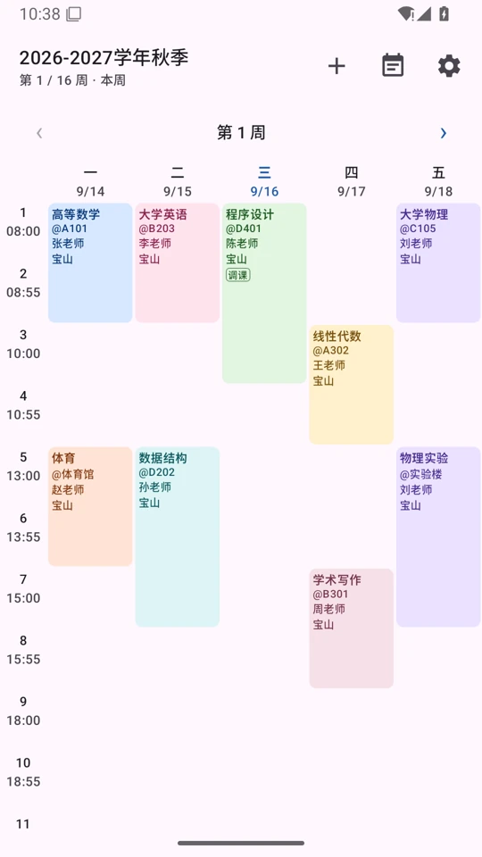
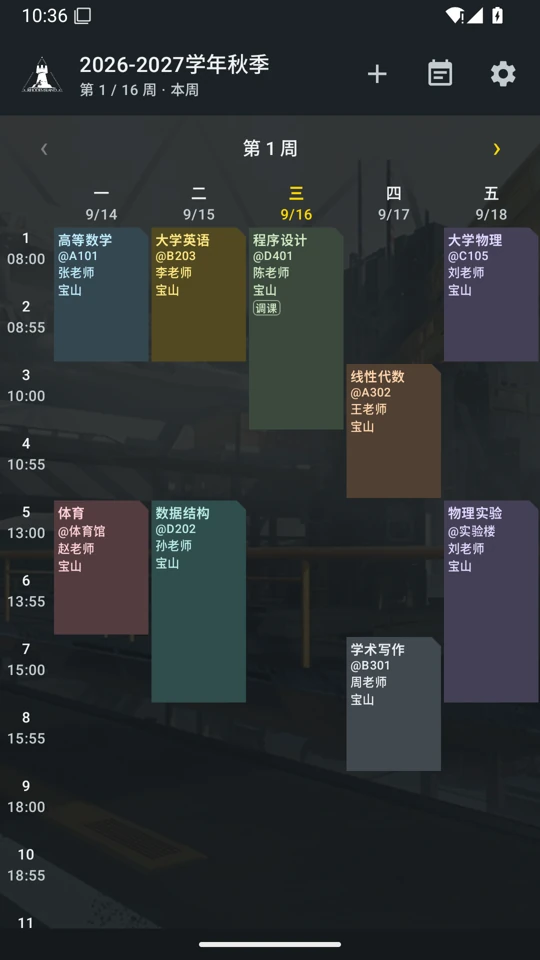
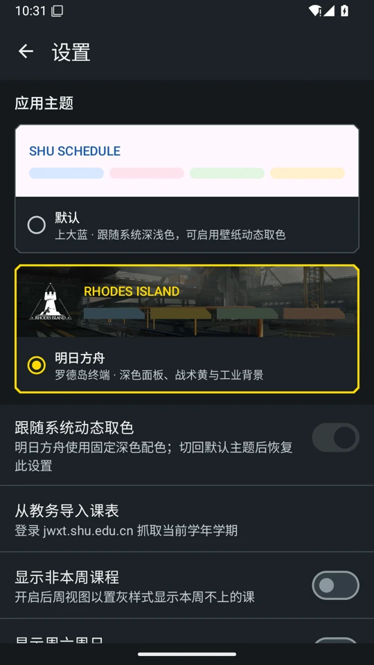
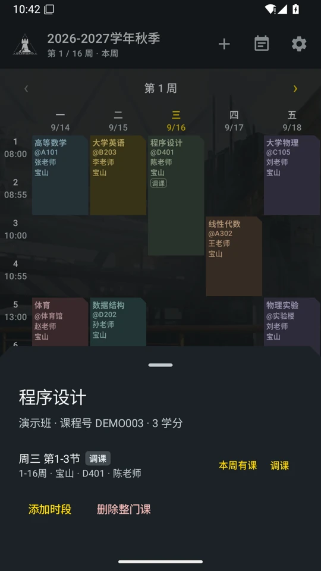

# 应用主题

在「设置 → 应用主题」中选择主题，即时生效并通过 DataStore 保存在本机。

- **默认**：保持原有上大蓝、系统深浅色及 Android 12+ 动态取色行为。
- **明日方舟**：固定深色，战术黄 / 罗德岛蓝、切角面板、工业背景及独立的八色课程色板。设置、学期管理、编辑弹窗等共享 Material 3 配色。课程文字使用不透明底色，背景仅作装饰。
- 明日方舟启用时暂停动态取色，但不改写该偏好；切回默认主题后恢复。
- 自选课表图片优先于内置主题背景；清除自选图片后恢复主题背景。图片在后台线程解码，并限制采样尺寸。
- 旧安装没有主题偏好、或主题 ID 无法识别时，回退默认主题。首次读取偏好完成后再绘制界面，避免默认主题闪现。
- 主题是本机外观偏好，不在课程 JSON 备份中；桌面小组件保持独立的原有样式，学校登录 WebView 显示学校网页本身。

## 扩展主题

1. 在 `data/settings/AppTheme.kt` 添加稳定 ID、名称、描述及深浅色 / 动态取色规则。持久化使用 ID，不能随意改名。
2. 在 `ui/theme/Theme.kt` 定义 Material 配色、形状及 `ScheduleStyle` 课程色板。课程记录只保存 `colorIndex`，不因切换主题改写数据库。
3. 根据需要扩展 `ScheduleScaffold` 与 `ThemePicker` 预览；图片使用本地 `drawable-nodpi` 资源。
4. 增补主题解析 / 配色对比度测试，检查设置、课表、弹窗和系统栏。

## 素材来源与版权

素材来自 [mashirozx/arknights-ui](https://github.com/mashirozx/arknights-ui)，固定版本 `8fb68d35992467c0cca9de953c5bd6227c316b97`。

| 本地文件 | 上游文件 | 处理 |
| --- | --- | --- |
| `app/src/main/res/drawable-nodpi/arknights_background.webp` | `img/UI_HOME_FRONT_BKG.png` | Pillow 等比缩小至 1280×720 范围，WebP quality=85 / method=6 |
| `app/src/main/res/drawable-nodpi/arknights_rhodes_island.png` | `img/UI_HOME.png` | 裁剪 `(486,1230,690,1408)`；亮度用作 alpha，白色前景，移除黑色面板 |

视觉参考为该仓库的 `screenshot.png`、`css/styles.css`：工业场景、黑白面板、黄色强调、蓝色辅助、切角轮廓。保留课表的原布局与信息密度，使用系统字体，不加载远程字体、人物立绘或脚本。

上游代码采用 MIT，许可证副本见 `third_party/arknights-ui-LICENSE.txt`。**游戏贴图不因此变为 MIT 授权素材**。上游 README 明确注明：「界面贴图素材都是游戏逆向出来的，仅供学习使用，请勿商用。」贴图、标识及相关角色版权归原权利人；本主题为非官方学习用途，无官方关联或背书。应用设置中同时展示来源和用途说明。

## 验证

```sh
./gradlew testDebugUnitTest assembleDebug lintDebug
```

人工回归：切换两款主题 → 返回课表 → 打开课程详情 / 编辑 → 切换系统深浅色 → 重启应用 → 再切回默认，检查主题和原动态取色偏好；检查空课表、五列 / 七列、有课 / 非本周课程及较大字体。

### 本次验证记录（2026-09-16）

- JDK 17：完整 clean 构建已通过；合入最新主分支后再次运行 `testDebugUnitTest assembleDebug` 成功，56 项 JVM 测试通过，其中新增 6 项主题解析、取色策略和文字对比度测试。
- Android 15 / API 35 模拟器：默认与明日方舟即时切换、强制结束进程后主题保留；动态取色原偏好为开 / 关时均可在往返切换后恢复。
- 核对空课表、五列 / 七列课表、非本周课程、课程详情、编辑弹窗、系统深浅色；411dp 常规显示与 360dp / 1.3 倍字体。弹窗单独适配系统栏图标，避免浅色系统下的深色主题弹窗出现黑色状态栏图标。
- `lintDebug` 有既存失败：`ImportScreen.kt:247` 的 `JavascriptInterface`。与原主分支 `d9db6a5` 独立检出对照，均为 1 error / 22 warnings / 6 informational，**没有新增 finding**，未关闭任何 lint 规则。
- 模拟器使用人工构造的测试课程，不涉及教务账号或真实学生数据；未进行学校登录及真实教务导入测试。
- 已合入主分支 `d9db6a5`，保留节假日调休与小组件改动；通过系统相册验证自选图片覆盖 / 清除恢复主题背景，原测试课表在 Room 升级后仍正常显示。

### 界面预览

以下为 Android 模拟器截图，课程内容均为演示数据。

| 默认课表 | 明日方舟课表 |
| --- | --- |
|  |  |

| 主题选择 | 课程详情 |
| --- | --- |
|  |  |
